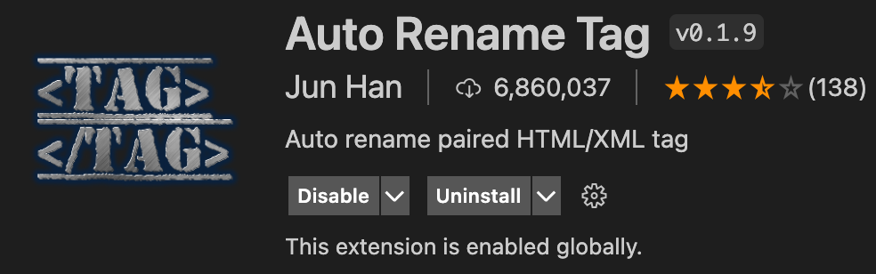

# HTML-CSS-Lecture

## Requirements

- [Visual Studio Code](https://code.visualstudio.com/)
  - 아래 익스텐션 설치방법
    - 
    - <b>위와 같이 클릭 후 검색하여 설치 진행</b>
  - Auto Rename Tag
    - 
  - Community material theme
    - 
  - Indent rainbow
    - 
  - Prettier - code formatter
    - 
  - Settings
    - 셋팅메뉴
      - 
    - Format on save : check
      - 
    - Format on save mode : file
      - 
    - Files : associations -> add item -> \*.html, html
      - 
- [Chrome Browser](https://www.google.co.kr/chrome/?brand=FKPE&gclid=CjwKCAjwwsmLBhACEiwANq-tXJmlGF5NPhXg47d-ceTn-jfPT5yqvWwQzKOlKs_TXVTUxADOYrjqlRoC7pMQAvD_BwE&gclsrc=aw.ds)
